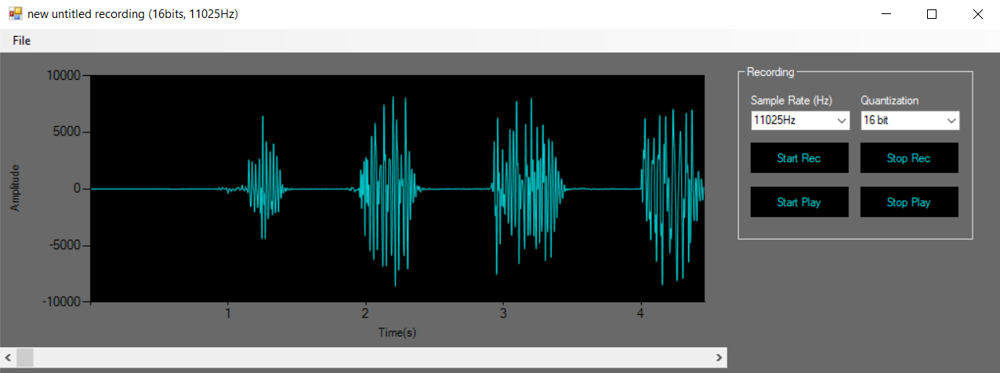
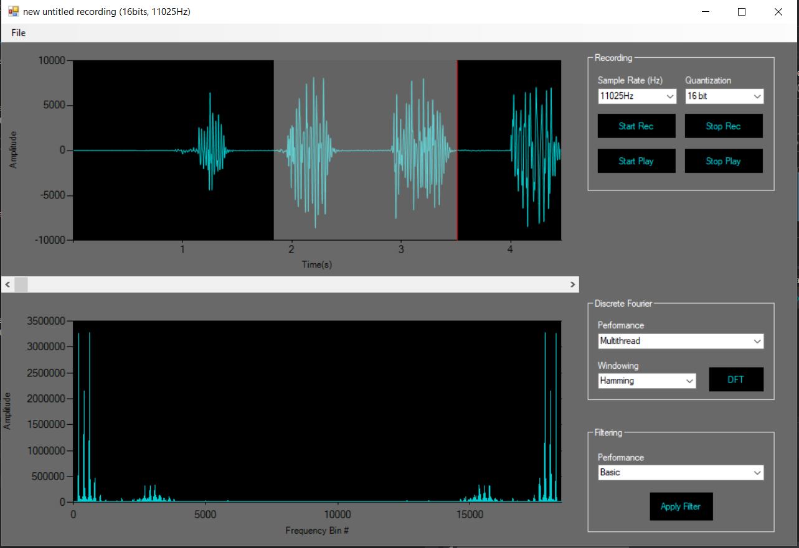
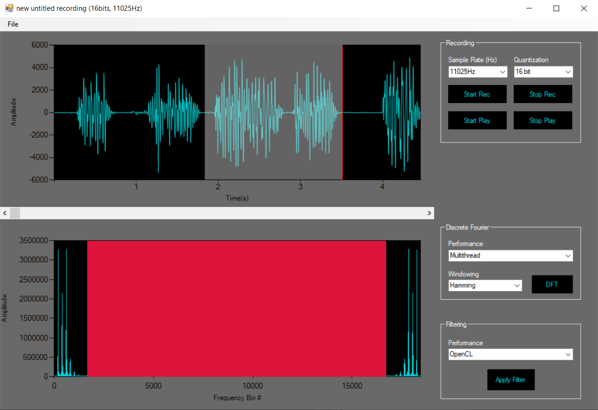

# WaveEditor

  

## Table of contents

*  [Overview](#Overview)
*  [Technologies](#technologies)
*  [Requirements](#requirements)
*  [Setup](#setup)
*  [Features](#features)
*  [Usage](#usage)
*  [Screenshots](#screenshots)

  
## Overview

This Wave Editor allows users to analyse Waveform audio data. Users can capture sounds from a microphone and display the sound in the temporal domain as well as in the frequency domain. Multiple digital audio processing techniques are used to process the data and further analyse it. Files can be read and saved using the MS-WAVE file format.

  
## Technologies
  
* C#
* C (win32)
* OpenCL

## Requirements

* Windows 10
* 1 gigahertz (GHz) or faster 32-bit (x86) or 64-bit (x64) processor
* Intel OpenCL drivers
* Visual Studio 2019

## Setup

  1. Download or clone the project. 
  2. Open the project solution file in Visual Studio
  3. Set x86 as your active solution platform
  4. Build and run the program
  Note: If you get any errors relating to windows not being able to find the dll, open the CWaveAPI project solution in Visual studio and resolve all dependency issues that may come up.

## Features

* Read/write uncompressed WAVE files (.wav)
* Record/play sounds at multiple sample rates and quantization levels
	* also supports playing  16bit stereo data
* Display sound data in the time domain
	* also supports displaying 16bit stereo data
* Apply discrete fourier transform to display sound data in the frequency domain
	* Single or multithread
* Apply 3 different windowing techniques to samples brought into the frequency domain 
	* Rectangular
	* Hamming
	* Hanning
* Filter out frequencies using a low pass filter
	* selecting basic C# or OpenCL to apply convolution
*  Cut/copy/paste between different sounds sampled at different rates (upsampling/downsampling)
 
## Usage

* To read from a WAVE file select File->Open from the top tool stip menu
* To record a sound use the Recording tool section, select your sample rate and quantization level from the dropdowns (11025Hz and 16bit are default)
* Upon stopping  a recording or opening a file, the sound data will be displayed in the time domain chart in the top left
* To analyse frequencies: 
	1. Click and drag over a portion of the sound in the time domain chart
	2. Using the Discrete Fourier tool section, select your level of performance (Single or Multithread), select your windowing technique and then click the DFT button to see the results
	3. Depending on your hardware, the level of performance you selected as well as the number of samples you selected, it may take some time to see the results
* Once the frequencies are displayed in the frequency domain chart on the bottom left, you can apply filtering
* To apply filtering:
	1. Click and drag from left to right over a section of the frequency domain chart on the left side of the graph (below the nyquist limit)
	2. As you drag your mouse, the frequencies to be filtered out will be highlighted in red as well as their aliases
	3. After you have selected your desired frequencies, select your level of performance from the Filtering tool section and click Apply Filter
	4. As with DFT, depending on your hardware, the level of performance you selected as well as the number of samples you selected, it may take some time to see the results
* Cut/copy/paste:
	1. Click and drag over a section of samples in the time domain
	2. Hold and click CTRL-C to copy
	3. Hold and click CTRL-X to cut
	4. To paste, click on the area of the sound in the time domain where you would like the samples, then hold and click CTRL-V to paste
	5. These steps can also be used between multiple insances of the program and between sounds of different sample rates
* Finally, to save a WAVE file select File->Save As from the top tool strip menu

## Screenshots

# Sound recording displayed in the time domain

# Samples from sound recording displayed in the frequency domain

# Selecting and applying low pass filter

 
